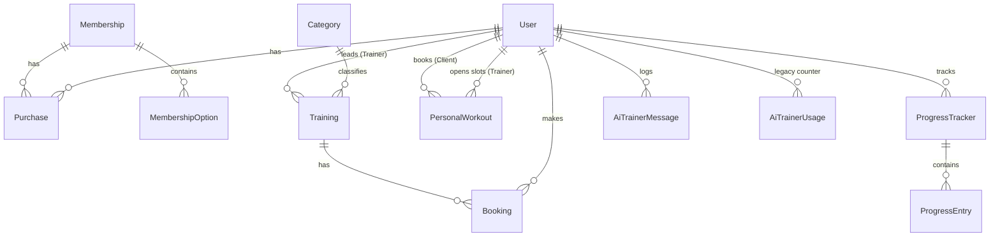

# FitnessCenter — Project Wiki (техническая документация)

Документ описывает актуальное состояние монорепозитория **Fitness_web**: ASP.NET Core Web API (раздаёт API и собранный SPA), React (Vite), PostgreSQL, Docker. Пути в тексте даны относительно корня репозитория.

---

## 1. Технологический стек

### 1.1. Бэкенд

| Компонент | Версия / выбор |
|-----------|----------------|
| Платформа | **.NET 8.0** (`TargetFramework: net8.0`) |
| Хостинг | ASP.NET Core Minimal hosting + Controllers |
| ORM | **Entity Framework Core 8.0.0** |
| СУБД | **PostgreSQL** (провайдер **Npgsql.EntityFrameworkCore.PostgreSQL 8.0.0**) |
| Аутентификация | **JWT Bearer** (`Microsoft.AspNetCore.Authentication.JwtBearer 8.0.0`) |
| Хэширование паролей | **BCrypt.Net-Next 4.0.3** |
| Валидация входных DTO | **FluentValidation.AspNetCore 11.3.0** + `AddFluentValidationAutoValidation()` |
| OpenAPI | **Swashbuckle.AspNetCore 6.5.0** (Swagger UI) |
| Внешний LLM | **OpenAI .NET SDK 2.1.0** с кастомным `Endpoint` (совместимость с DeepSeek и прокси) |

**Ключевые файлы проекта API:** `backend/FitnessCenter.API/FitnessCenter.API.csproj`, `Program.cs`.

### 1.2. Фронтенд

| Компонент | Версия |
|-----------|--------|
| Сборка | **Vite 5.x**, **TypeScript 5.3** |
| UI | **React 18.2** |
| Библиотека компонентов | **Material UI 5.15** (`@mui/material`, `@mui/icons-material`) |
| Таблицы / данные | **@mui/x-data-grid 6.18** |
| Дата/время | **@mui/x-date-pickers 6.20**, **dayjs 1.11** |
| HTTP | **axios 1.6** |
| Маршрутизация | **react-router-dom 6.20** |
| Глобальное состояние | **zustand 4.4** |

**Точка входа:** `frontend/src/main.tsx`, маршруты — `frontend/src/App.tsx`.

### 1.3. Инфраструктура и инструментарий

- **Docker:** многостадийная сборка в `Dockerfile`: Node 20 → сборка SPA в `wwwroot`, .NET SDK 8 → `dotnet publish`, финальный образ `aspnet:8.0`.
- **Compose:** `docker-compose.yml` — сервисы `postgres` (16-alpine) и `app` (порт **5000**), том `uploads` для файлов, переменные окружения для строки подключения, JWT и **DeepSeek** (`DeepSeek__ApiKey`, `DeepSeek__BaseUrl`, `DeepSeek__Model`).
- **Статика и SPA fallback:** в `Program.cs` после пайплайна API вызывается `MapFallbackToFile("index.html")` — все не-API запросы отдают React-приложение.
- **Загрузки файлов:** каталоги `wwwroot/uploads/users` и `wwwroot/uploads/trainers` создаются при старте; раздача через `UseStaticFiles()`.

---

## 2. Архитектура базы данных

### 2.1. Подход к схеме и «миграциям»

В проекте **не используется** классический конвейер EF Core Migrations (папки `Migrations/` в репозитории нет). Вместо этого:

1. При старте приложения вызывается `db.Database.EnsureCreated()` — создаёт БД и таблицы по текущей модели **только если БД пустая** (на новой БД).
2. Для существующих инсталляций схема дополняется в **`Data/SeedData.cs`** через сырой SQL: `ALTER TABLE ... IF NOT EXISTS`, `CREATE TABLE IF NOT EXISTS`, `CREATE INDEX IF NOT EXISTS`, а также точечные `UPDATE` (например, заполнение `TrainerId`).

**Вывод для эксплуатации:** эволюция схемы завязана на код `SeedData` и `OnModelCreating`; для продакшена обычно предпочтительны явные EF-миграции — текущий подход удобен для dev/Docker, но требует дисциплины при изменении модели.

### 2.2. Сущности (Entities)

Ниже — логическая модель. Физические имена таблиц в PostgreSQL по соглашению EF — в кавычках с заглавной буквы (например `"Users"`, `"Trainings"`), как в SQL внутри `SeedData`.

#### `User`

| Поле | Тип | Описание |
|------|-----|----------|
| `Id` | `uuid` PK | Идентификатор |
| `Email` | string | Уникальный индекс |
| `PasswordHash` | string | BCrypt |
| `Role` | string (max 20) | `Admin`, `User`, `Trainer` |
| `FullName` | string | |
| `PhotoUrl` | string? (max 500) | URL относительно сайта, например `/uploads/users/...` |
| `TrainerRank` | int? | Ранг тренера 1–5 (для роли `Trainer`) |
| `CreatedAt` | DateTime | UTC |

**Связи (навигация):** см. диаграмму ниже.

#### `Category`

- `Id` int PK, `Name` string.
- **1:N** → `Training`.

#### `Training` (групповая тренировка)

| Поле | Описание |
|------|----------|
| `Id` | int PK |
| `CategoryId` | FK → `Category` |
| `TrainerId` | FK → `User` (роль тренера) |
| `Description`, `StartTime`, `MaxParticipants` | |

Индексы: `StartTime`, `CategoryId`, `TrainerId`. Удаление тренера из БД при «увольнении» обрабатывается в сервисе (удаление тренировок); FK в модели: `OnDelete(Restrict)` для связи с тренером.

#### `Membership`

- Абонемент: цена, длительность в днях, описание, опции.
- **1:N** → `MembershipOption`, **1:N** → `Purchase`.

#### `MembershipOption`

- FK `MembershipId` → `Membership`, каскадное удаление.

#### `Purchase`

- Связь пользователь ↔ купленный абонемент.
- `Status`: enum `PurchaseStatus` — `Pending`, `Paid`.
- `PriceAtPurchase` decimal(10,2).

#### `Booking`

- Запись пользователя на **групповую** тренировку.
- `Status`: `Active`, `Cancelled`.
- **Уникальный индекс** `(TrainingId, UserId)` с **фильтром** только для активных записей (`"Status" = 0`), чтобы разрешить историю отменённых без блокировки повторной записи.

#### `PersonalWorkout`

- Слот персональной тренировки: тренер, опционально клиент, дата/время, цена, `IsBooked`.
- **Уникальный индекс** `(TrainerId, DateTime)` — один слот на момент времени у тренера.
- FK: тренер — cascade delete; клиент — set null при удалении пользователя.

#### `ProgressTracker` / `ProgressEntry`

- Трекер принадлежит пользователю; записи замеров каскадно удаляются с трекером.

#### `AiTrainerUsage` (устаревшая/вспомогательная таблица)

- Суточный счётчик в модели; **фактический лимит** в коде переведён на `AiTrainerMessage`.

#### `AiTrainerMessage`

- Лог **успешных** ответов чата для подсчёта дневного лимита.
- Индекс `(UserId, CreatedAt)`.

### 2.3. Диаграмма связей (логическая)

**Связи по кардинальности:**

- **User 1:N Purchase**, **Membership 1:N Purchase** (N:1 с каждой стороны к Purchase).
- **User 1:N Booking**, **Training 1:N Booking**.
- **Category 1:N Training**, **User (Trainer) 1:N Training**.
- **User (Trainer) 1:N PersonalWorkout** (как тренер), **User (Client) 0:N PersonalWorkout** (как клиент, nullable FK).
- **User 1:N ProgressTracker**, **ProgressTracker 1:N ProgressEntry**.
- Отдельной связи M:N между пользователями нет; пересечение «тренер–клиент» выражено через `PersonalWorkout` и `Training`/`Booking`.

---

## 3. Ролевая модель и безопасность

### 3.1. Роли в JWT и в БД

Роль хранится в **`User.Role`** строкой. При логине/регистрации в JWT кладётся claim **`ClaimTypes.Role`** (= строка роли) плюс `sub` (Guid пользователя), `email`, произвольный `fullName`.

Поддерживаемые значения в админ-операциях смены роли: **`Admin`**, **`User`**, **`Trainer`** (`AdminController.UpdateRole`).

**Замечание:** контроллер `AiTrainerController` помечен `[Authorize(Roles = "User,Client")]`. Роль **`Client`** при стандартной регистрации **не присваивается** (`AuthService.RegisterAsync` задаёт `Role = "User"`). Указание `Client` в политике — задел под единый «клиентский» claim или legacy; фактически работают пользователи с ролью **`User`**.

### 3.2. Механизм проверки доступа

- **Не cookies:** состояние сессии на стороне API не хранится; клиент передаёт **`Authorization: Bearer <JWT>`**.
- **Не policy-based в смысле отдельных `AuthorizationHandler`:** используются стандартные атрибуты **`[Authorize]`** и **`[Authorize(Roles = "...")]`** на контроллерах/методах.
- **FluentValidation** отклоняет некорректные тела запросов до входа в экшены (автовалидация).

### 3.3. Права по ролям (обзор)

| Роль | Типичный доступ |
|------|------------------|
| **Гость** | Регистрация/логин, просмотр каталога абонементов, групповых тренировок, категорий; страницы логина/регистрации на фронте. |
| **User** | Покупка/оплата абонемента (имитация), запись на групповые и персональные тренировки (после оплаты — см. бизнес-логику), прогресс, профиль, загрузка аватара (не для тренера), AI Trainer при «активном» абонементе по правилам `MembershipAccessService`. |
| **Trainer** | Расписание персональных слотов, просмотр своих слотов, чтение/обновление прогресса клиентов **только при наличии забронированной персональной тренировки** с этим клиентом. Групповые тренировки ведутся как у пользователя-тренера в модели `Training`, но UI скрывает разделы клиента. |
| **Admin** | Пользователи (список, смена роли), тренеры (как `User` с ролью Trainer — CRUD имени/ранга/фото/удаление), абонементы, групповые тренировки, все покупки, все бронирования, персональные записи (список/отмена). |

### 3.4. Глобальная обработка ошибок

`Middleware/ExceptionMiddleware.cs` перехватывает исключения и возвращает **ProblemDetails**-совместимый JSON:

- `KeyNotFoundException` → **404**
- `UnauthorizedAccessException` → **403**
- `InvalidOperationException` → **400**
- прочее → **500**

---

## 4. Справочник API Endpoints

Базовый префикс: **`/api`**. На фронтенде `axios` использует `baseURL: '/api'`, т.е. вызовы вида `api.get('/auth/me')` → **`/api/auth/me`**.

Имена контроллеров по умолчанию: **`[controller]`** = имя класса без суффикса `Controller` (регистр путей в ASP.NET Core обычно не чувствителен к нему). Исключение: **`AiTrainerController`** задаёт явный маршрут **`api/ai-trainer`**.

### 4.1. `AuthController` — маршрут `api/auth`

| Метод | Путь | Тело / параметры | Ответ | Доступ |
|-------|------|------------------|-------|--------|
| POST | `/api/auth/register` | `RegisterDto` (email, password, fullName) | `AuthResponse` (token + `UserDto`) | Аноним |
| POST | `/api/auth/login` | `LoginDto` | `AuthResponse` | Аноним |
| GET | `/api/auth/me` | — | `UserDto` | **Authorize** (любой валидный JWT) |
| POST | `/api/auth/me/photo` | `multipart/form-data` файл | `UserDto` | **Authorize**; тренерам загрузка запрещена в `AuthService` |

### 4.2. `AdminController` — `api/admin`

| Метод | Путь | Вход | Ответ | Доступ |
|-------|------|------|-------|--------|
| GET | `/api/admin/users` | query: `page`, `pageSize`, `search` | `PagedResult<UserDto>` | **Admin** |
| PUT | `/api/admin/users/{id}/role` | body: строка роли | `UserDto` | **Admin** |
| GET | `/api/admin/personal-workouts` | `page`, `pageSize` | `PagedResult<PersonalWorkoutSlotDto>` | **Admin** |
| DELETE | `/api/admin/personal-workouts/{slotId}/cancel` | — | 204 | **Admin** |

### 4.3. `MembershipsController` — `api/memberships`

| Метод | Путь | Вход | Ответ | Доступ |
|-------|------|------|-------|--------|
| GET | `/api/memberships` | фильтры цены, поиск, пагинация | `PagedResult<MembershipDto>` | Аноним |
| GET | `/api/memberships/{id}` | — | `MembershipDto` | Аноним |
| POST | `/api/memberships` | `CreateMembershipDto` | `MembershipDto` | **Admin** |
| PUT | `/api/memberships/{id}` | `UpdateMembershipDto` | `MembershipDto` | **Admin** |
| DELETE | `/api/memberships/{id}` | — | 204 | **Admin** |

### 4.4. `CategoriesController` — `api/categories`

| Метод | Путь | Вход | Ответ | Доступ |
|-------|------|------|-------|--------|
| GET | `/api/categories` | — | `List<CategoryDto>` | Аноним |
| POST | `/api/categories` | `CreateCategoryDto` | `CategoryDto` | **Admin** |

### 4.5. `CoachesController` — `api/coaches` (пользователи с ролью Trainer)

| Метод | Путь | Вход | Ответ | Доступ |
|-------|------|------|-------|--------|
| GET | `/api/coaches` | — | `List<CoachDto>` | Аноним |
| PUT | `/api/coaches/{id}` | `UpdateCoachDto` | `CoachDto` | **Admin** |
| DELETE | `/api/coaches/{id}` | — | 204 | **Admin** |
| POST | `/api/coaches/{id}/photo` | файл | `CoachDto` | **Admin** |

### 4.6. `TrainingsController` — `api/trainings`

| Метод | Путь | Вход | Ответ | Доступ |
|-------|------|------|-------|--------|
| GET | `/api/trainings` | query: пагинация, `categoryId`, `trainerId`, `date`, `search` | `PagedResult<TrainingDto>` | Аноним |
| GET | `/api/trainings/{id}` | — | `TrainingDto` | Аноним |
| POST | `/api/trainings` | `CreateTrainingDto` | `TrainingDto` | **Admin** |
| PUT | `/api/trainings/{id}` | `UpdateTrainingDto` | `TrainingDto` | **Admin** |
| DELETE | `/api/trainings/{id}` | — | 204 | **Admin** |

### 4.7. `PurchasesController` — `api/purchases`

| Метод | Путь | Вход | Ответ | Доступ |
|-------|------|------|-------|--------|
| GET | `/api/purchases/my` | пагинация | `PagedResult<PurchaseDto>` | **User, Admin** |
| GET | `/api/purchases` | пагинация, `search` | `PagedResult<PurchaseDto>` | **Admin** |
| POST | `/api/purchases` | `CreatePurchaseDto` | `PurchaseDto` | **User, Admin** |
| POST | `/api/purchases/{id}/pay` | — | `PurchaseDto` | **User, Admin** |

### 4.8. `BookingsController` — `api/bookings`

| Метод | Путь | Вход | Ответ | Доступ |
|-------|------|------|-------|--------|
| GET | `/api/bookings/my` | — | `List<BookingDto>` | **User, Admin** |
| GET | `/api/bookings` | пагинация | `PagedResult<BookingDto>` | **Admin** |
| POST | `/api/bookings` | `CreateBookingDto` | `BookingDto` | **User, Admin** |
| DELETE | `/api/bookings/{id}` | — | 204 | **User, Admin** (отмена своей записи в сервисе по userId) |

### 4.9. `ProgressController` — `api/progress`

| Метод | Путь | Вход | Ответ | Доступ |
|-------|------|------|-------|--------|
| GET | `/api/progress/trackers` | — | `List<ProgressTrackerDto>` | **User, Admin** |
| POST | `/api/progress/trackers` | `CreateTrackerDto` | `ProgressTrackerDto` | **User, Admin** |
| DELETE | `/api/progress/trackers/{id}` | — | 204 | **User, Admin** |
| GET | `/api/progress/trackers/{trackerId}/entries` | — | `List<ProgressEntryDto>` | **User, Admin** |
| POST | `/api/progress/trackers/{trackerId}/entries` | `CreateEntryDto` | `ProgressEntryDto` | **User, Admin** |

### 4.10. `WorkoutsController` — `api/workouts`

| Метод | Путь | Вход | Ответ | Доступ |
|-------|------|------|-------|--------|
| GET | `/api/workouts/trainers` | — | `List<TrainerListItemDto>` | **Authorize** (любой JWT) |
| GET | `/api/workouts/trainer/{trainerId}/slots` | — | `List<PersonalWorkoutSlotDto>` | **Authorize** |
| GET | `/api/workouts/my` | `history` bool | `List<PersonalWorkoutSlotDto>` | **User, Admin** |
| POST | `/api/workouts/buy/{slotId}` | — | `PersonalWorkoutSlotDto` | **User, Admin** (на уровне контроллера); **сервис `BuySlotAsync` принимает только покупателя с ролью `User`** — вызов под учётной записью **Admin** завершится ошибкой бизнес-логики |
| DELETE | `/api/workouts/my/{slotId}` | — | 204 | **User, Admin** |

### 4.11. `TrainerController` — `api/trainer`

| Метод | Путь | Вход | Ответ | Доступ |
|-------|------|------|-------|--------|
| GET | `/api/trainer/my-workouts` | `history` | `List<PersonalWorkoutSlotDto>` | **Trainer** |
| POST | `/api/trainer/slots` | `CreatePersonalWorkoutSlotDto` | `PersonalWorkoutSlotDto` | **Trainer** |
| GET | `/api/trainer/client-progress/{clientId}` | — | `List<ProgressTrackerDto>` | **Trainer** |
| GET | `/api/trainer/client-progress/{clientId}/trackers/{trackerId}/entries` | — | `List<ProgressEntryDto>` | **Trainer** |
| POST | `/api/trainer/update-progress` | `TrainerUpdateProgressDto` | `List<ProgressTrackerDto>` | **Trainer** |

### 4.12. `AiTrainerController` — **`api/ai-trainer`**

| Метод | Путь | Вход | Ответ | Доступ |
|-------|------|------|-------|--------|
| GET | `/api/ai-trainer/status` | — | `AiTrainerStatusDto` | **User, Client** |
| POST | `/api/ai-trainer/chat` | `AiTrainerChatRequestDto` | `AiTrainerChatResponseDto` | **User, Client** |

---

## 5. Бизнес-логика и функциональные модули

### 5.1. Абонементы и покупки

- Клиент создаёт покупку со статусом **`Pending`**, затем вызывает **оплату** (`PayAsync`) — статус **`Paid`**.
- Каталог абонементов и CRUD для админа — `MembershipService`.

### 5.2. Проверка «активного абонемента» (два разных правила)

В проекте задействованы **два независимых критерия**:

1. **`MembershipAccessService`** (AI Trainer, отображение статуса): учитываются покупки со статусом **`Paid` или `Pending`**, срок = `CreatedAt + DurationDays` (если `DurationDays <= 0`, подставляется **30**). Если по датам «активных» нет, но покупки есть — **legacy fallback: доступ всё равно true** (чтобы не блокировать из-за старых данных).
2. **`PersonalWorkoutService.EnsurePaidMembershipAsync`** и **`BookingService.EnsurePaidMembershipAsync`**: для записи на персональные и групповые тренировки требуется наличие покупки со статусом строго **`Paid`**.

**Следствие:** теоретически возможна ситуация, когда AI считает абонемент активным (например, только `Pending`), а запись на тренировку отклоняется. Это важно для согласования требований при доработке.

### 5.3. Групповые тренировки и бронирование

- `TrainingService` отдаёт список с подсчётом **`CurrentParticipants`** как число бронирований со статусом **`Active`**.
- `BookingService.CreateAsync`: проверка лимита `MaxParticipants`, защита от дубля активной записи, **обязательна оплаченная покупка** (`Paid`).
- Отмена: мягко — `Booking.Status = Cancelled` (запись остаётся в БД).

### 5.4. Персональные тренировки и цена по рангу

- Тренер создаёт слот: `CreateTrainerSlotAsync` — время в будущем, уникальность `(TrainerId, DateTime)`.
- Цена: **`1000 + (rank - 1) * 500`**, где `rank = Clamp(TrainerRank ?? 1, 1, 5)`.
- При бронировании клиентом цена пересчитывается от ранга тренера; **фактически бронирует только пользователь с ролью `User`** (`BuySlotAsync` явно проверяет роль). Атрибут контроллера допускает `Admin`, но такой вызов не пройдёт проверку в сервисе.
- Фильтр слотов для клиента: `!IsBooked && DateTime > UtcNow`.
- История vs предстоящие: порог `DateTime <= now` vs `> now` для списков клиента/тренера.

### 5.5. Прогресс клиента и роль тренера

- Клиент управляет своими трекерами через `ProgressService`.
- Тренер: `PersonalWorkoutService.EnsureTrainerCanManageClientAsync` — есть хотя бы одна **`PersonalWorkout`** с `IsBooked`, этим тренером и данным `ClientId`.
- Обновление антропометрии тренером: `UpdateClientProgressAsync` создаёт/находит трекеры по фиксированным названиям («Вес», «Грудь», «Талия», «Бедра») и добавляет `ProgressEntry`.

Расчёт **динамики** в DTO трекера: сравнение последнего и предпоследнего замера, процент при ненулевом предыдущем значении (см. `MapTracker` в `ProgressService` / `PersonalWorkoutService`).

### 5.6. Увольнение тренера

`TrainingService.DeleteCoachAsync`: запрет при активных групповых бронированиях любой тренировки этого тренера; запрет при любых **забронированных** персональных слотах; иначе удаляются все его `Training`, все `PersonalWorkout`, затем `User`.

### 5.7. AI Trainer

- Лимит: **10 успешных сообщений в сутки** (UTC-день по `CreatedAt` в `AiTrainerMessages`).
- Списание лимита **после** успешного ответа модели.
- System prompt собирает ФИО, email, последние трекеры и замеры, до 8 последних групповых активных бронирований и персональных записей.
- Клиент SDK: `ChatClient` с `ApiKeyCredential` и `OpenAIClientOptions.Endpoint`.

### 5.8. Загрузка изображений

- Пользователи (не тренеры): `wwwroot/uploads/users/`.
- Тренеры: только админ, `wwwroot/uploads/trainers/`.
- Удаление предыдущего файла при замене, если путь начинается с `/uploads/`.

---

## 6. Типичный путь данных (CRUD / запрос)

Унифицированный паттерн:

1. **HTTP** → `Controllers/*Controller.cs`.
2. Авторизация и привязка пользователя: `User.FindFirstValue(ClaimTypes.NameIdentifier)` → `Guid userId`.
3. Валидация DTO: **FluentValidation** (регистрация сборки в `Program.cs`).
4. Делегирование в **scoped-сервис** (`*Service.cs`): LINQ/EF, бизнес-правила, исключения (`InvalidOperationException`, `KeyNotFoundException`, `UnauthorizedAccessException`).
5. Маппинг сущностей в **records DTO** (`DTOs/Dtos.cs`) происходит в сервисах или проекциями `.Select(...)` / локальными функциями `Map*`.
6. Сохранение: `_db.SaveChangesAsync()`.
7. Ошибки не перехватываются в контроллере — их обрабатывает **`ExceptionMiddleware`**.

Отдельных классов AutoMapper в решении нет: маппинг ручной.

---

## 7. Фронтенд-архитектура

### 7.1. Слои

- **`api/client.ts`**: единый axios-инстанс, `baseURL: '/api'`, интерцептор JWT из `localStorage`, редирект на `/login` при **401**.
- **Состояние:**
  - **`stores/authStore.ts`** — Zustand: токен, пользователь, login/register/logout, `loadUser` через `GET /auth/me`.
  - **`stores/notificationStore.ts`** — уведомления (см. `NotificationSnackbar`).
  - **`stores/cartStore.ts`** — вспомогательное состояние корзины (если используется на страницах абонементов).
- **Типы:** `types/index.ts` — зеркалируют DTO (в т.ч. AI Trainer, тренеры, слоты).

### 7.2. Маршрутизация и layout

- **`App.tsx`**: вложенные маршруты.
  - Публичный блок с **`Layout`** (AppBar, навигация, `Outlet`, **`AiTrainerWidget`**).
  - Админ-блок: **`AdminLayout`** под `ProtectedRoute requiredRole="Admin"`.
- **`ProtectedRoute`**: редирект неавторизованных на логин; опционально `requiredRole` и **`disallowedRoles`** (например, `/progress` недоступен тренеру).

**Нюанс:** страницы `/trainings` и `/memberships` не обёрнуты в `ProtectedRoute`; ограничение для тренера реализовано в основном через **скрытие пунктов меню** в `Layout.tsx` и условный контент на страницах — прямой URL может оставаться доступен.

### 7.3. Основные страницы

| Путь | Файл | Назначение |
|------|------|------------|
| `/` | `HomePage.tsx` | Лендинг |
| `/login`, `/register` | `LoginPage.tsx`, `RegisterPage.tsx` | Аутентификация |
| `/memberships` | `MembershipsPage.tsx` | Каталог абонементов |
| `/trainings` | `TrainingsPage.tsx` | Групповые тренировки, запись, модалка Google Calendar |
| `/personal-workouts` | `PersonalWorkoutsPage.tsx` | Выбор тренера, слотов, запись |
| `/profile` | `ProfilePage.tsx` | Профиль, аватар, покупки, групповые и персональные записи, отмены |
| `/progress` | `ProgressPage.tsx` | Трекеры клиента (`ProgressTrackersBoard`) |
| `/trainer/schedule` | `TrainerSchedulePage.tsx` | Календарь слотов тренера |
| `/trainer/client/:id` | `TrainerClientProgressPage.tsx` | Прогресс клиента + редактирование тренером |
| `/admin/*` | `pages/admin/*` | Пользователи, «тренеры», абонементы, тренировки, покупки, персональные записи |

### 7.4. Переиспользуемые компоненты

- **`ProgressTrackersBoard.tsx`** — доска трекеров (клиент и тренер).
- **`AiTrainerWidget.tsx`** — плавающий чат: статус, дисклеймер, лимиты, вызовы `/ai-trainer/status` и `/ai-trainer/chat`.
- **`utils/calendar.ts`** — генерация ссылок Google Calendar (TEMPLATE).

### 7.5. Тема и UI

- **`theme.ts`** — настройки MUI (палитра, типографика).
- **`main.tsx`** — провайдеры Router, MUI Theme, при необходимости LocalizationProvider для date pickers на страницах.

---

## 8. Конфигурация и секреты

- **`appsettings.json`** содержит строку подключения, JWT и блок **DeepSeek** (в репозитории могут быть плейсхолдеры; для продакшена секреты должны задаваться через переменные окружения).
- **`docker-compose.yml`** пробрасывает `ConnectionStrings__*`, `JwtSettings__*`, `DeepSeek__*` в контейнер `app`.

---

## 9. Краткий указатель файлов бэкенда

| Область | Путь |
|---------|------|
| Точка входа, DI, pipeline | `backend/FitnessCenter.API/Program.cs` |
| EF модель | `backend/FitnessCenter.API/Data/AppDbContext.cs` |
| Сиды и SQL-совместимость | `backend/FitnessCenter.API/Data/SeedData.cs` |
| DTO | `backend/FitnessCenter.API/DTOs/Dtos.cs` |
| Валидация | `backend/FitnessCenter.API/Validators/Validators.cs` |
| Доменные модели | `backend/FitnessCenter.API/Models/*.cs` |
| Сервисы | `backend/FitnessCenter.API/Services/*.cs` |
| Контроллеры | `backend/FitnessCenter.API/Controllers/*.cs` |
| Ошибки | `backend/FitnessCenter.API/Middleware/ExceptionMiddleware.cs` |

---

*Документ сгенерирован по состоянию кодовой базы репозитория Fitness_web; при изменении контроллеров или сервисов актуализируйте разделы 4–5.*
